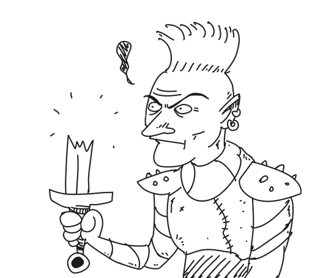
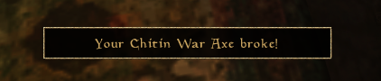

# Shards & Splinters

## Features

This mod adds the chance for your weapons and shields to break if you don’t take care of them. An item broken that way is entirely destroyed and is removed from your inventory. Most weapons and shields can shatter, except for those of higher quality like adamantium, dwemer, and daedric. Artifact weapons are safe, your regular magical weapon or shield is not.

When the condition of your weapon or shield drops below a certain threshold, there’s a growing chance it might shatter mid-fight. Your luck attribute decreases this chance.

## Configuration

Customize the mod to your liking with these settings:

* **Enable or disable the chance for your weapon breaking.**
* **Enable or disable the chance for your shield breaking.**
* **Durability Threshold:** Set the durability percentage at below weapons and shields are at risk.
* **Luck Modifier:** Negativly affects how luck affects weapon and shield breaking chances. (A greater number increases the chance.)
* **Whitelisted Materials and Types:** List of materials and weapons that won’t shatter. The keywords are based on the model name of the weapon or shield.
* **Debug Log:** Toggle extra console information for debugging.

## Roadmap

* Add chance of weapons shattering - **DONE**
* Add chance of shields shattering - **DONE**
* Magical weapons explode upon shattering, causing their magical damage to you - **Not possible with the current version of OpenMW AFAIK** 

**This is my first-ever Lua mod for OpenMW. I hope you enjoy it!**
